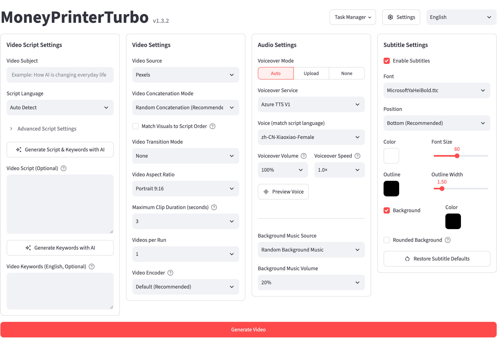
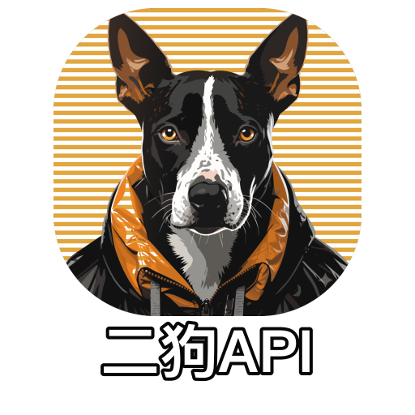

<div align="center">

# MoneyPrinterTurbo 💸

### Gerador de vídeos curtos com IA tudo-em-um

Informe um <b>tema</b> ou <b>palavra-chave</b> para o vídeo e o MoneyPrinterTurbo gera o roteiro, combina imagens, cria legendas e trilha sonora e produz um vídeo curto em HD.

[](https://github.com/harry0703/MoneyPrinterTurbo/releases)
[](https://github.com/harry0703/MoneyPrinterTurbo/releases/latest)
[](https://www.python.org/)
[](https://github.com/harry0703/MoneyPrinterTurbo/releases/latest)

<a href="https://trendshift.io/repositories/8731" target="_blank"></a>
<a href="https://www.star-history.com/harry0703/moneyprinterturbo"></a>

Português | [English](README-en.md) | [Chinês simplificado](README-zh.md) | [Lançamentos](https://github.com/harry0703/MoneyPrinterTurbo/releases) | [Issues](https://github.com/harry0703/MoneyPrinterTurbo/issues)

</div>

## Capturas de tela 🖥️

<h4 align="center">WebUI</h4>



<h4 align="center">API</h4>


## Agradecimentos especiais ❤️

<div align="center">
  <a href="https://platform.kimi.ai?aff=MoneyPrinterTurbo" target="_blank"></a>
</div>

Agradecemos ao [Kimi](https://platform.kimi.ai?aff=MoneyPrinterTurbo) por patrocinar este projeto! O [Kimi K2.7 Code](https://platform.kimi.ai/docs/guide/kimi-k2-7-code-quickstart) é um modelo agente open source focado em programação, desenvolvido pela Moonshot AI, com ganhos expressivos em tarefas reais de codificação de longo horizonte e maior taxa de sucesso ponta a ponta em fluxos complexos de engenharia de software. Também reduz o uso de tokens de raciocínio em cerca de 30% em relação ao K2.6. No MoneyPrinterTurbo, o LLM do Kimi impulsiona a criação de vídeos: escreve o roteiro e extrai as palavras-chave de busca que definem as imagens finais — quanto mais precisa a compreensão, mais aderentes ficam os resultados.

**O MoneyPrinterTurbo já suporta Kimi. Visite a [Kimi Open Platform](https://platform.kimi.ai?aff=MoneyPrinterTurbo) ([Site em chinês](https://platform.kimi.com?aff=MoneyPrinterTurbo) | [Global](https://platform.kimi.ai?aff=MoneyPrinterTurbo)) para experimentar a API ou conheça o [Coding Plan](https://www.kimi.com/code?aff=MoneyPrinterTurbo) com bom custo-benefício.**
<br>
<table align="center">
  <tr>
    <td align="center" width="120">
      <a href="https://www.byteplus.com/en/product/modelark?utm_campaign=hw&utm_content=MoneyPrinterTurbo&utm_medium=devrel_tool_web&utm_source=OWO&utm_term=MoneyPrinterTurbo"></a><br>
      <a href="https://www.byteplus.com/en/product/modelark?utm_campaign=hw&utm_content=MoneyPrinterTurbo&utm_medium=devrel_tool_web&utm_source=OWO&utm_term=MoneyPrinterTurbo"><strong>BytePlus ModelArk</strong></a>
    </td>
    <td align="left">
      Agradecemos ao Dola Seed por patrocinar este projeto! O <a href="https://www.byteplus.com/en/product/modelark?utm_campaign=hw&utm_content=MoneyPrinterTurbo&utm_medium=devrel_tool_web&utm_source=OWO&utm_term=MoneyPrinterTurbo">Dola Seed 2.0</a> é um grande modelo multimodal geral desenvolvido de forma independente pela ByteDance para o mercado global. Com arquitetura multimodal unificada, suporta compreensão e geração conjunta de texto, imagens, áudio e vídeo. Habilita colaboração entre agentes nativamente, com raciocínio forte, execução de tarefas longas, integração de ferramentas e capacidades de codificação. Cadastre-se pelo link para receber 500.000 tokens de cota gratuita de inferência por modelo.
    </td>
  </tr>
  <tr>
    <td align="center" width="120">
      <a href="https://www.ccsub.net/register?ref=VCVDAWWY"></a><br>
      <a href="https://www.ccsub.net/register?ref=VCVDAWWY"><strong>CCSub</strong></a>
    </td>
    <td align="left">
      Agradecemos ao <a href="https://www.ccsub.net/register?ref=VCVDAWWY">CCSub</a> por patrocinar este projeto! O CCSub é uma plataforma estável e acessível de relay de API de IA — substituto direto de uma assinatura Claude.ai. Uma chave de API dá acesso a Claude Opus 4.8, Sonnet, Haiku, GPT-5 e Gemini por cerca de 30% do custo da API direta, sem VPN em qualquer lugar do mundo. Compatível com Claude Code, Codex, Cursor, Cline, Continue, Windsurf e as principais ferramentas de codificação com IA. Registre-se em <a href="https://www.ccsub.net/register?ref=VCVDAWWY">www.ccsub.net</a> e ganhe US$ 5 de crédito ao se cadastrar.
    </td>
  </tr>
  <tr>
    <td align="center" width="120">
      <a href="https://www.compshare.cn/coding-plan?ytag=GPU_YY-git_MoneyPrinterTu"></a><br>
      <a href="https://www.compshare.cn/coding-plan?ytag=GPU_YY-git_MoneyPrinterTu"><strong>Compshare</strong></a>
    </td>
    <td align="left">
      Agradecemos ao <a href="https://www.compshare.cn/coding-plan?ytag=GPU_YY-git_MoneyPrinterTu">Compshare</a> por patrocinar este projeto! O Compshare é uma plataforma de nuvem de IA da UCloud que oferece acesso unificado por uma única chave aos principais modelos chineses e internacionais. O pacote CodingPlan foca em modelos chineses com bom custo-benefício, como GLM5.2 e Deepseek-v4, além de canais oficiais estáveis para modelos internacionais em diferentes cenários de desenvolvimento. Compatível com Claude Code, Codex e outras ferramentas populares de codificação com IA e chamadas de API gerais, com alta concorrência de nível empresarial, suporte técnico 24/7 e emissão de notas fiscais self-service. <a href="https://www.compshare.cn/coding-plan?ytag=GPU_YY-git_MoneyPrinterTu">Cadastre-se agora</a> para receber até ¥10 em créditos de teste gratuitos.
    </td>
  </tr>
  <tr>
    <td align="center" width="120">
      <a href="https://cubence.com/signup?code=SCE1CJPE&source=mpt"></a><br>
      <a href="https://cubence.com/signup?code=SCE1CJPE&source=mpt"><strong>Cubence</strong></a>
    </td>
    <td align="left">
      Agradecemos ao <a href="https://cubence.com/signup?code=SCE1CJPE&source=mpt">Cubence</a> por apoiar este projeto. O Cubence é uma plataforma focada em acesso a API de modelos de IA, ajudando desenvolvedores e equipes a chamar modelos de forma estável e conveniente. Desde o lançamento em setembro de 2025, o Cubence suporta cenários de acesso a API para Claude Code, Codex, Gemini e outras ferramentas de IA para desenvolvedores, ideal para quem precisa gerenciar e acessar várias capacidades de modelos de forma unificada. O Cubence oferece aos usuários do MoneyPrinterTurbo um código de desconto exclusivo: <a href="https://cubence.com/signup?code=SCE1CJPE&source=mpt"><code>MPT</code></a>. Use-o na primeira compra para obter <a href="https://cubence.com/signup?code=SCE1CJPE&source=mpt">10% de desconto</a>.
    </td>
  </tr>
  <tr>
    <td align="center" width="120">
      <a href="https://www.0029.org/?promo=AFF1"></a><br>
      <a href="https://www.0029.org/?promo=AFF1"><strong>0029.org</strong></a>
    </td>
    <td align="left">
      Agradecemos ao <a href="https://www.0029.org/?promo=AFF1">0029.org</a> por patrocinar este projeto! O 0029.org é uma plataforma de relay de API de IA tudo-em-um com os modelos mais recentes para Claude Code, Codex e Gemini. Oferece acesso estável, responsivo e econômico via assinaturas mensais ou pay-as-you-go, atende usuários individuais e empresas e é acessível diretamente da China continental sem VPN. Preços a partir de 1,2% das tarifas oficiais. <a href="https://www.0029.org/?promo=AFF1">Visite 0029.org</a>.
    </td>
  </tr>
  <tr>
    <td align="center" width="120">
      <a href="https://ergouapi.com/r/gh-moneyprinterturbo"></a><br>
      <a href="https://ergouapi.com/r/gh-moneyprinterturbo"><strong>Ergou API</strong></a>
    </td>
    <td align="left">
      Agradecemos ao <a href="https://ergouapi.com/r/gh-moneyprinterturbo">Ergou API</a> por patrocinar este projeto! Ergou API: o gateway de API de IA sólido como rocha. Desbloqueie multiplicadores ultra baixos (0,1x - 0,2x) em toda a plataforma. Oferecemos endpoints 100% genuínos e sem filtros para LLMs de ponta, incluindo Claude, GPT e Gemini. Com rotas IPLC premium e redundância dual de ISP residencial, a Ergou garante estabilidade comprovada e latência ultra baixa para seu tráfego global. Feito para desenvolvedores e estúdios. <a href="https://ergouapi.com/r/gh-moneyprinterturbo">Cadastre-se e comece a construir hoje</a>.
    </td>
  </tr>
  <tr>
    <td align="center" width="120">
      <a href="https://reccloud.com"></a><br>
      <a href="https://reccloud.com"><strong>RecCloud</strong></a>
    </td>
    <td align="left">
      Devido ao <strong>deploy</strong> e ao <strong>uso</strong> deste projeto, há certa barreira para alguns usuários iniciantes. Agradecemos especialmente ao <a href="https://reccloud.com">RecCloud (plataforma de serviços multimídia com IA)</a> por oferecer gratuitamente o serviço <code>AI Video Generator</code> baseado neste projeto. Permite uso online sem deploy, o que é muito conveniente.
    </td>
  </tr>
  <tr>
    <td align="center" width="120">
      <a href="https://picwish.com"></a><br>
      <a href="https://picwish.com"><strong>Picwish</strong></a>
    </td>
    <td align="left">
      Agradecemos ao <a href="https://picwish.com">Picwish</a> por apoiar e patrocinar este projeto, permitindo atualizações e manutenção contínuas. O Picwish atua no <strong>campo de processamento de imagens</strong>, com um conjunto rico de <strong>ferramentas de imagem</strong> que simplificam operações complexas, tornando o tratamento de imagens mais fácil.
    </td>
  </tr>
</table>

## Recursos 🎯

- [x] Oferece fluxos **AI Agent**, **WebUI**, **API** e **CLI**, com código organizado por responsabilidades de controller, service e model
- [x] Suporta **roteiros de vídeo gerados por IA** e roteiros personalizados
- [x] Suporta vários tamanhos de **vídeo em alta definição**
  - [x] Retrato 9:16, `1080x1920`
  - [x] Paisagem 16:9, `1920x1080`
- [x] Suporta **geração em lote de vídeos**, permitindo criar vários de uma vez e escolher o mais
      satisfatório
- [x] Suporta definir a **duração dos clipes**, facilitando o ajuste da frequência de troca de material
- [x] Suporta geração de **roteiros multilíngues**
- [x] Suporta síntese de voz com **Edge TTS**, **Azure Speech**, **SiliconFlow**, **Google Gemini**, **Xiaomi MiMo**, **ElevenLabs** e **Chatterbox**, com pré-visualização em tempo real
- [x] Suporta **geração de legendas** com fontes, posição, cor, tamanho, contorno e fundo configuráveis
- [x] Suporta **música de fundo** aleatória ou personalizada, com volume ajustável
- [x] Suporta **materiais locais** próprios e imagens HD gratuitas do **Pexels**, **Pixabay** e **Coverr**
- [x] Suporta provedores líderes, incluindo **Kimi / Moonshot AI**, **OpenAI**, **Google Gemini**, **DeepSeek**, **Alibaba Cloud Qwen**, **Microsoft Azure OpenAI**, **ByteDance VolcEngine Ark**, **xAI Grok**, **MiniMax** e **Xiaomi MiMo**, além de gateways unificados, agregadores e runtimes locais como **Cloudflare AI Gateway**, **Alibaba ModelScope**, **AIHubMix**, **AIML API**, **EvoLink**, **Ollama**, **OneAPI**, **LiteLLM**, **Groq** e **Pollinations AI**
- [x] Suporta **publicação multiplataforma** com um clique no **TikTok**, **Instagram** e **YouTube Shorts** após a geração do vídeo

## Galeria 🎬

Todos os exemplos abaixo foram gerados com MoneyPrinterTurbo.

### Retrato 9:16

<table width="100%">
<tr>
<td align="center" width="25%"><a href="https://harry0703.github.io/mpt-assets/?video=03-zh-portrait-city-morning.mp4"></a><br><strong>When the City Wakes</strong><br>Chinês · 14 s</td>
<td align="center" width="25%"><a href="https://harry0703.github.io/mpt-assets/?video=05-zh-portrait-clean-energy.mp4"></a><br><strong>The Future of Clean Energy</strong><br>Chinês · 24 s</td>
<td align="center" width="25%"><a href="https://harry0703.github.io/mpt-assets/?video=07-zh-portrait-space-exploration.mp4"></a><br><strong>Why We Still Explore Space</strong><br>Chinês · 27 s</td>
<td align="center" width="25%"><a href="https://harry0703.github.io/mpt-assets/?video=17-zh-portrait-seed-journey.mp4"></a><br><strong>A Seed's Journey</strong><br>Chinês · 44 s</td>
</tr>
<tr>
<td align="center" width="25%"><a href="https://harry0703.github.io/mpt-assets/?video=09-en-portrait-future-robotics.mp4"></a><br><strong>The Future of Everyday Robotics</strong><br>Inglês · 21 s</td>
<td align="center" width="25%"><a href="https://harry0703.github.io/mpt-assets/?video=11-en-portrait-small-habits.mp4"></a><br><strong>Small Habits, Lasting Change</strong><br>Inglês · 19 s</td>
<td align="center" width="25%"><a href="https://harry0703.github.io/mpt-assets/?video=13-en-portrait-creative-work.mp4"></a><br><strong>Making Space for Creative Work</strong><br>Inglês · 20 s</td>
<td align="center" width="25%"><a href="https://harry0703.github.io/mpt-assets/?video=15-en-portrait-coffee-science.mp4"></a><br><strong>The Science Inside Coffee</strong><br>Inglês · 23 s</td>
</tr>
</table>

### Paisagem 16:9

<table width="100%">
<tr>
<td align="center" width="25%"><a href="https://harry0703.github.io/mpt-assets/?video=02-zh-landscape-deep-ocean.mp4"></a><br><strong>Light in the Deep Ocean</strong><br>Chinês · 23 s</td>
<td align="center" width="25%"><a href="https://harry0703.github.io/mpt-assets/?video=04-zh-landscape-reading-power.mp4"></a><br><strong>How Reading Shapes Us</strong><br>Chinês · 23 s</td>
<td align="center" width="25%"><a href="https://harry0703.github.io/mpt-assets/?video=06-zh-landscape-pour-over-coffee.mp4"></a><br><strong>The Details of Pour-Over Coffee</strong><br>Chinês · 23 s</td>
<td align="center" width="25%"><a href="https://harry0703.github.io/mpt-assets/?video=08-zh-landscape-spring-journey.mp4"></a><br><strong>Spring Is Made for Travel</strong><br>Chinês · 14 s</td>
</tr>
<tr>
<td align="center" width="25%"><a href="https://harry0703.github.io/mpt-assets/?video=10-en-landscape-ocean-conservation.mp4"></a><br><strong>Why Ocean Conservation Matters</strong><br>Inglês · 25 s</td>
<td align="center" width="25%"><a href="https://harry0703.github.io/mpt-assets/?video=14-en-landscape-sustainable-cities.mp4"></a><br><strong>Designing More Sustainable Cities</strong><br>Inglês · 27 s</td>
<td align="center" width="25%"><a href="https://harry0703.github.io/mpt-assets/?video=16-en-landscape-mountain-perspective.mp4"></a><br><strong>What Mountains Teach Us</strong><br>Inglês · 18 s</td>
<td align="center" width="25%"><a href="https://harry0703.github.io/mpt-assets/?video=18-en-landscape-history-of-flight.mp4"></a><br><strong>A Brief History of Human Flight</strong><br>Inglês · 59 s</td>
</tr>
</table>

## Requisitos do sistema 📦

- Plataformas recomendadas: Windows 10+, macOS 11+ ou uma distribuição Linux mainstream
- Deploy local requer Python 3.14 ou superior; Python 3.14 é recomendado
- GPU não é obrigatória, mas é recomendada para transcrição local mais rápida, processamento de vídeo mais ágil ou geração em lote mais fluida

| Item | Mínimo      | Recomendado  | Ideal      |
| ---- | ------------ | ------------ | ---------- |
| CPU  | 4 núcleos    | 6 a 8 núcleos | 8+ núcleos |
| RAM  | 4 GB         | 8 GB         | 16+ GB     |
| GPU  | Não obrigatória | 4+ GB VRAM | 8+ GB VRAM |

- Se você depende principalmente de LLMs na nuvem, TTS na nuvem e fontes de material online, CPU e RAM importam mais que GPU
- Se usa `faster-whisper`, geração em lote ou processamento local mais pesado, uma GPU melhora bastante a taxa de processamento

## Início rápido 🚀

### Caminhos recomendados

- Se não quiser instalar ou configurar o projeto manualmente: gere vídeos com um AI Agent
- Usuários Windows: use primeiro o pacote one-click para o teste local mais rápido
- Usuários macOS / Linux: use `uv` como caminho principal de configuração local
- Se quiser um runtime mais isolado: use deploy com Docker

### Gerar vídeos com um AI Agent

Se seu AI Agent consegue ler documentos Skill e operar um terminal local, envie o prompt abaixo. O Agent instalará e configurará o MoneyPrinterTurbo, gerará o vídeo e devolverá o caminho do arquivo. Ele pedirá apenas as chaves de API obrigatórias que ainda não estiverem configuradas. Este fluxo suporta atualmente macOS e Windows.

```text
Use this Skill: https://raw.githubusercontent.com/harry0703/MoneyPrinterTurbo/main/docs/skill/SKILL.md
Create a video with the topic "How AI is changing everyday life."
```

### Executar no Google Colab

Quer experimentar o MoneyPrinterTurbo sem configurar ambiente local? Execute direto no Google Colab!

[](https://colab.research.google.com/github/harry0703/MoneyPrinterTurbo/blob/main/docs/MoneyPrinterTurbo.ipynb)

### Windows

Baixe o pacote one-click mais recente para Windows em GitHub Releases e extraia diretamente.

- GitHub Release: https://github.com/harry0703/MoneyPrinterTurbo/releases/latest

Após baixar, recomenda-se **clicar duas vezes** em `update.bat` primeiro para atualizar para o **código mais recente** e depois clicar duas vezes em `start.bat` para iniciar

Após iniciar, o navegador abrirá automaticamente (se abrir em branco, use **Chrome** ou **Edge**)

### macOS / Linux

Use as instruções de configuração local ou Docker abaixo.

## Instalação e deploy 📥

### Pré-requisitos

- Deploy local requer Python 3.14 ou superior
- No Windows, evite caminhos de projeto com caracteres não ASCII, caracteres especiais ou espaços

#### ① Clonar o projeto

```shell
git clone https://github.com/harry0703/MoneyPrinterTurbo.git
```

#### ② Configurar o projeto (opcional)

Na primeira execução, o projeto cria `config.toml` a partir de `config.example.toml`. Você pode configurar o provedor de LLM, fonte de imagens e chaves de API relacionadas diretamente nas configurações básicas da WebUI.

### Deploy com Docker 🐳

#### ① Iniciar o container Docker

Se ainda não instalou o Docker, instale primeiro https://www.docker.com/products/docker-desktop/
Se usa Windows, consulte a documentação da Microsoft:

1. https://learn.microsoft.com/en-us/windows/wsl/install
2. https://learn.microsoft.com/en-us/windows/wsl/tutorials/wsl-containers

```shell
cd MoneyPrinterTurbo
docker compose -f docker-compose.release.yml up
```

> O padrão recomendado é `docker-compose.release.yml`, que puxa a imagem pré-construída do GitHub Container Registry: `ghcr.io/harry0703/moneyprinterturbo:latest`.
> Se precisar construir a imagem localmente, ainda pode executar `docker compose up`.
> Antes da primeira inicialização, copie `config.example.toml` para `config.toml` para montá-lo nos containers.

#### ② Acessar a WebUI

Abra o navegador e visite http://127.0.0.1:8501

#### ③ Acessar a documentação da API

Abra o navegador e visite http://127.0.0.1:8080/docs ou http://127.0.0.1:8080/redoc

### Deploy manual 📦

#### ① Criar ambiente virtual Python

Use [uv](https://docs.astral.sh/uv/) para gerenciar o ambiente Python e dependências. O projeto suporta Python 3.14 ou superior; o exemplo abaixo usa Python 3.14.

```shell
git clone https://github.com/harry0703/MoneyPrinterTurbo.git
cd MoneyPrinterTurbo
uv python install 3.14
uv sync --frozen
```

Se ainda não usa `uv`, ainda pode usar `venv + pip`.

```shell
python3.14 -m venv .venv
source .venv/bin/activate
pip install -r requirements.txt
```

Observações:

- `pyproject.toml` é agora o manifesto principal de dependências.
- `uv.lock` fixa o ambiente resolvido; `uv sync --frozen` é recomendado por padrão.
- `requirements.txt` é mantido apenas para instalação legada com `pip`.

#### ② Iniciar a WebUI 🌐

Note que você precisa executar os comandos abaixo no `diretório raiz` do projeto MoneyPrinterTurbo

###### Windows

```powershell
.\webui.bat
```

Também pode executar `webui.bat` no CMD.
O `webui.bat` prefere o `.venv` do projeto ou Python empacotado do pacote portátil. Se nenhum Python do projeto for encontrado mas `uv` estiver instalado, faz fallback automático para `uv run streamlit`.
Para permitir que outros dispositivos na LAN acessem a WebUI, execute `set MPT_WEBUI_HOST=0.0.0.0` antes de rodar `webui.bat`.

###### macOS ou Linux

```shell
sh webui.sh
```

O script usa automaticamente o ambiente virtual do projeto ou `uv` e seleciona uma porta local disponível. Para permitir acesso de outros dispositivos na LAN:

```shell
MPT_WEBUI_HOST=0.0.0.0 sh webui.sh
```

Após iniciar, o navegador abrirá automaticamente

#### ③ Iniciar o serviço de API 🚀

```shell
uv run python main.py
```

Se já ativou o ambiente virtual manualmente, ainda pode executar:

```shell
python main.py
```

#### ④ Modo CLI puro (sem navegador) ⌨️

Se não puder usar navegador ou port forwarding, gere vídeos diretamente pela
linha de comando. O comando completo de geração mais simples é:

```shell
uv run python cli.py --video-subject "How AI is changing everyday life."
```

Para a referência completa de comandos, descrição de parâmetros e instruções de uso,
execute:

```shell
uv run python cli.py --help
```

## Síntese de voz 🗣

O provedor padrão é o **Edge TTS** gratuito, exibido como **Azure TTS V1** na WebUI. O MoneyPrinterTurbo também suporta **Azure TTS V2**, **SiliconFlow TTS**, **Google Gemini TTS**, **Xiaomi MiMo TTS**, **ElevenLabs TTS**, **Chatterbox TTS** self-hosted e um modo sem voz.

Selecione provedor e voz na WebUI e siga as instruções na tela para credenciais necessárias. Edge TTS não exige chave de API; [Azure TTS V2](https://portal.azure.com/) e outros provedores na nuvem exigem credenciais das respectivas plataformas. Veja as vozes Edge TTS disponíveis na [lista de vozes](./docs/voice-list.txt).

## Geração de legendas 📜

Dois modos de geração de legendas estão disponíveis:

- **edge**: Usa timestamps do TTS, roda rápido sem GPU, e é o modo padrão.
- **whisper**: Usa transcrição local com `faster-whisper` quando uma linha do tempo de legendas mais precisa é necessária. O modelo é baixado no primeiro uso.

Defina `subtitle_provider` em `config.toml` para alternar modos. O Whisper usa por padrão o modelo `large-v3` de aproximadamente 3 GB. Para usar o modelo menor e mais rápido `large-v3-turbo`, de aproximadamente 1,6 GB:

```toml
[app]
subtitle_provider = "whisper"

[whisper]
model_size = "large-v3-turbo"
```

> No primeiro uso, o Whisper baixa automaticamente o modelo do Hugging Face. Se o download automático falhar, baixe `whisper-large-v3` manualmente no [Hugging Face](https://huggingface.co/Systran/faster-whisper-large-v3).

Após extrair o modelo, coloque o diretório inteiro em `.\MoneyPrinterTurbo\models`. O caminho final deve ser `.\MoneyPrinterTurbo\models\whisper-large-v3`:

```
MoneyPrinterTurbo
  ├─models
  │   └─whisper-large-v3
  │          config.json
  │          model.bin
  │          preprocessor_config.json
  │          tokenizer.json
  │          vocabulary.json
```

## Música de fundo 🎵

A música de fundo dos vídeos fica no diretório `resource/songs` do projeto.

> O projeto atual inclui algumas músicas padrão de vídeos do YouTube. Se houver problemas de direitos autorais, exclua-as.

## Fontes de legendas 🅰

As fontes para renderizar legendas nos vídeos ficam no diretório `resource/fonts` do projeto, e você também pode adicionar
suas próprias fontes.

## Perguntas frequentes 🤔

<details>
<summary>Como publico no TikTok, Instagram ou YouTube Shorts?</summary>

Crie uma conta e chave de API no [Upload-Post](https://upload-post.com/) e adicione as configurações abaixo em `[app]` no `config.toml`:

```toml
[app]
upload_post_enabled = true
upload_post_api_key = "your-api-key"
upload_post_username = "your-username"
upload_post_platforms = ["tiktok", "instagram", "youtube"]
upload_post_auto_upload = true
upload_post_youtube_privacy_status = "public"
```

Reinicie o app após salvar. Os vídeos gerados serão publicados automaticamente nas plataformas configuradas. A privacidade no YouTube pode ser `public`, `unlisted` ou `private`.

</details>

<details>
<summary>RuntimeError: No ffmpeg exe could be found</summary>

Normalmente, o ffmpeg será baixado e detectado automaticamente.
Porém, se seu ambiente impedir downloads automáticos, você pode ver o erro abaixo:

```
RuntimeError: No ffmpeg exe could be found.
Install ffmpeg on your system, or set the IMAGEIO_FFMPEG_EXE environment variable.
```

Nesse caso, baixe o ffmpeg em https://www.gyan.dev/ffmpeg/builds/, descompacte e defina `ffmpeg_path` para o
caminho real da instalação.

```toml
[app]
# Ajuste conforme seu caminho real; no Windows use \\ como separador
ffmpeg_path = "C:\\Users\\harry\\Downloads\\ffmpeg.exe"
```

</details>

<details>
<summary>OSError: [Errno 24] Too many open files</summary>

Esse problema é causado pelo limite do sistema de arquivos abertos. Você pode resolvê-lo aumentando o limite.

Verifique o limite atual:

```shell
ulimit -n
```

Se estiver muito baixo, aumente, por exemplo:

```shell
ulimit -n 10240
```

</details>

<details>
<summary>Falha no download do modelo Whisper</summary>

```
LocalEntryNotFoundError: Cannot find an appropriate cached snapshot folder for the specified revision on the local disk and
outgoing traffic has been disabled.
To enable repo look-ups and downloads online, pass 'local_files_only=False' as input.
```

ou

```
An error occurred while synchronizing the model Systran/faster-whisper-large-v3 from the Hugging Face Hub:
An error happened while trying to locate the files on the Hub and we cannot find the appropriate snapshot folder for the
specified revision on the local disk. Please check your internet connection and try again.
Trying to load the model directly from the local cache, if it exists.
```

Solução: [Veja como baixar o modelo manualmente no Hugging Face](#geração-de-legendas-)

</details>

## MoneyPrinter Panel (fábrica multi-nicho)

Painel de controle Django pessoal para nichos → pesquisa no YouTube → Create/Clip/Dub → upload por canal.

Consulte [`panel/README.md`](panel/README.md). Início rápido (WSL): `bash start_panel_wsl.sh` → http://127.0.0.1:8000/admin/

## Feedback e sugestões 📢

- Você pode abrir uma [issue](https://github.com/harry0703/MoneyPrinterTurbo/issues) ou um [pull request](https://github.com/harry0703/MoneyPrinterTurbo/pulls).

## Licença 📝

Clique para ver o arquivo [`LICENSE`](LICENSE)

## Star History

<a href="https://www.star-history.com/?repos=harry0703%2FMoneyPrinterTurbo&type=date&legend=top-left">
 <picture>
   <source media="(prefers-color-scheme: dark)" srcset="https://api.star-history.com/chart?repos=harry0703/MoneyPrinterTurbo&type=date&theme=dark&legend=top-left&sealed_token=AtOR8By6GcNKd46eJLixrnucHF_99GOSBBKfc60pAm2xsDylemaYxDMcvTlPRz-G_onzDrs-hDrM0xdKkn0L6PgDin3fv02ViVtsZvgRYgk0YOzkX2KgLG8wro66VGphii-u6GNpzD8JocrqGGKvsFSpmbRqo5g-2mEDaN7-ESdtF48ZH0rDOCpoc1Mh" />
   <source media="(prefers-color-scheme: light)" srcset="https://api.star-history.com/chart?repos=harry0703/MoneyPrinterTurbo&type=date&legend=top-left&sealed_token=AtOR8By6GcNKd46eJLixrnucHF_99GOSBBKfc60pAm2xsDylemaYxDMcvTlPRz-G_onzDrs-hDrM0xdKkn0L6PgDin3fv02ViVtsZvgRYgk0YOzkX2KgLG8wro66VGphii-u6GNpzD8JocrqGGKvsFSpmbRqo5g-2mEDaN7-ESdtF48ZH0rDOCpoc1Mh" />
   
 </picture>
</a>
